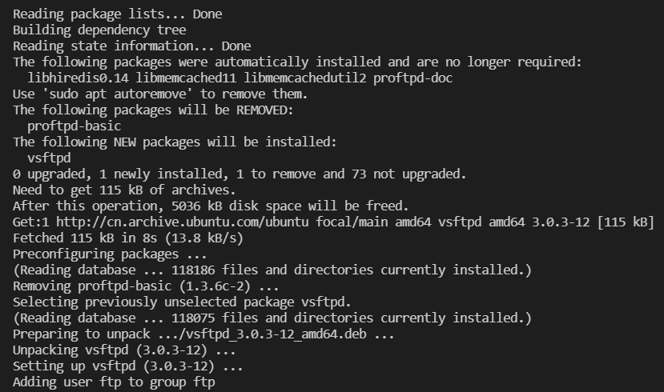
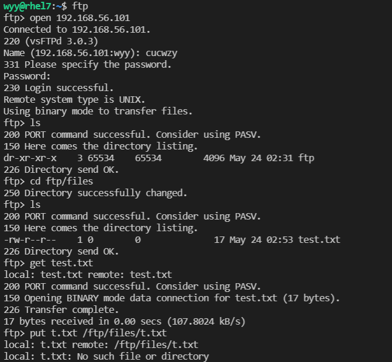
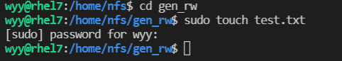
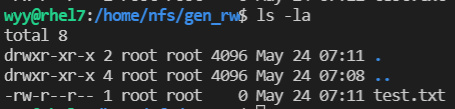
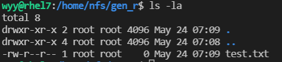
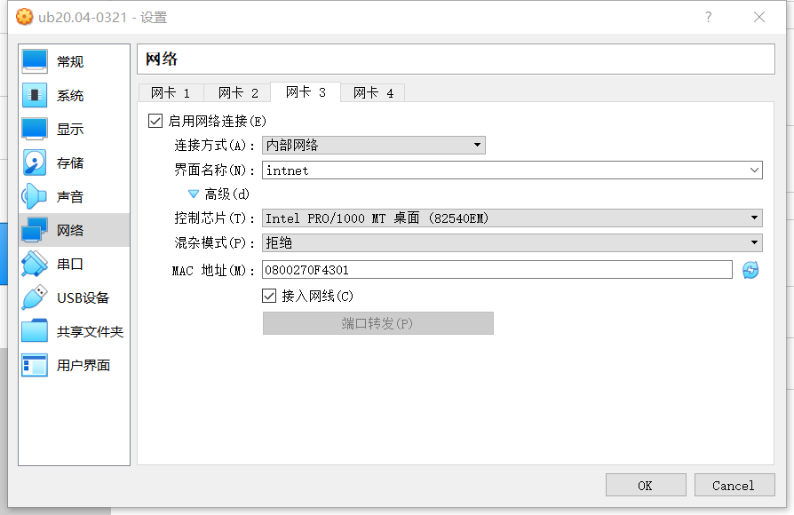
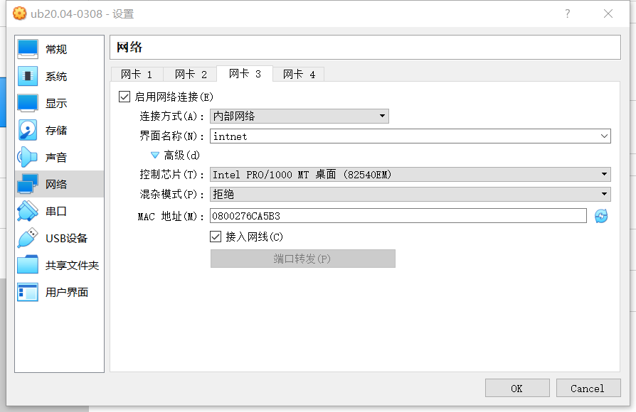
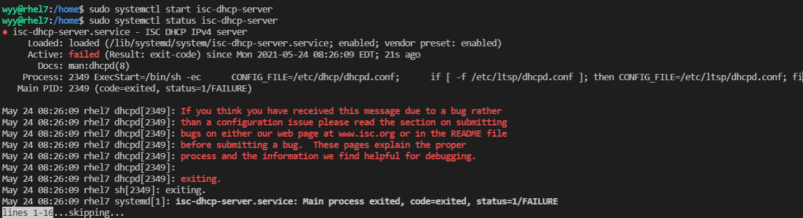
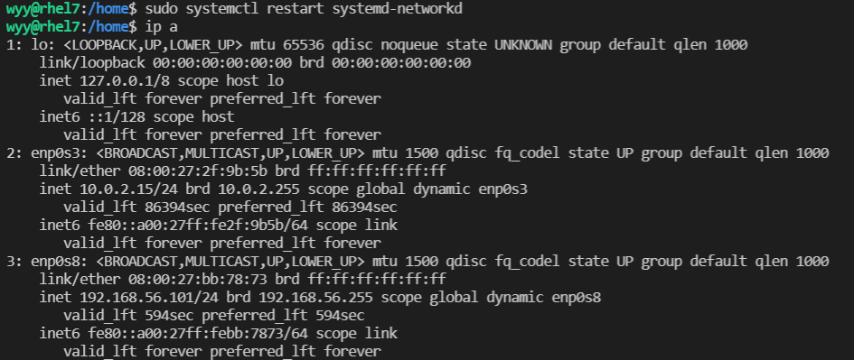
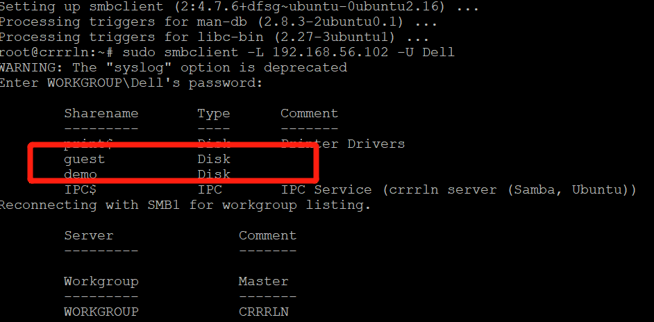

# 第六章实验：shell脚本编程练习进阶
## FTP、NFS、DHCP、DNS、Samba服务器的自动安装与自动配置

# 实验环境
  - Ubuntu 20.04
  - 最新版本的vbox

# 一.服务器的配置
 
 ## 配置工作主机到目标主机的远程SSH免密登录
  - 目标主机ssh配置
  ```
  开启ssh服务
  sudo service ssh start

  修改ssh配置文件
  sudo vim /etc/ssh/sshd_config

  修改内容
  设置可通过口令认证SSH
  PasswordAuthentication yes

  允许root用户登录
  PermitRootLogin yes

  重启ssh服务
  sudo systemctl restart ssh
  ```
  - 工作主机配置
  ```
  生成公私钥
  ssh-keygen -f .ssh/key

  将公钥传输至目标主机authorized_keys文件
  ssh-copy-id -i ~/.ssh/key root@192.168.56.101

  测试连接，输入密码
  ssh root@192.168.56.101
  ```
  - 目标主机免密配置
  ```
  修改ssh配置文件
  sudo vim /etc/ssh/sshd_config

  修改内容
  PasswordAuthentication no
  PermitRootLogin without-password

  重启ssh服务
  sudo systemctl restart ssh
  ```

 # FTP
   - 服务器软件选择:vsftpd
   - 脚本：vsftpd.sh
   - 配置文件: /ect/vsftpd.conf
   
   - 运行vsftpd.sh脚本
   

   - 配置一个提供匿名访问的FTP服务器，匿名访问者可以访问1个目录且仅拥有该目录及其所有子目录的只读访问权限 
    
     - 修改vsftpd.conf文件
     ```
     anon_mkdir_write_enable=NO
     sudo service vsftpd restart
     ```
     - 配置一个提供匿名访问的FTP服务器
      
      

     - 匿名访问者可以访问1个目录且仅拥有该目录及其所有子目录的只读访问权限 
      

   - 配置一个支持用户名和密码方式访问的账号，该账号继承匿名访问者所有权限，且拥有对另1个独立目录及其子目录完整读写（包括创建目录、修改文件、删除文件等）权限
     - 用户名密码登录
     
     
     - 创建目录、修改文件、删除文件
     

   - 匿名访问权限仅限白名单IP来源用户访问，禁止白名单IP以外的访问 
   ```
   grep -q "vsftpd:192.168.56.101" /etc/hosts.allow || echo "192.168.56.101" >> /etc/hosts.allow
   ```
   - FTP用户不能越权访问指定目录之外的任意其他目录和文件 # 限制用户使用权限只限于用户目录
   ```
   sed -i -e "/chroot_local_user=/s/^[#]//g;/chroot_local_user=/s/YES/g" "$conf"
   ```

 # NFS
 - 脚本：nfs_client.sh,nfs_host.sh
 - 配置文件: /ect/exports

 - 运行nfs_client.sh脚本
   

 - 运行nfs_host.sh脚本
   

 - 在1台Linux上配置NFS服务，另1台电脑上配置NFS客户端挂载2个权限不同的共享目录，分别对应只读访问和读写访问权限
 
   - 创建的两个目录分别为:只读/nfs/gen_r和读写/nfs/gen_rw 
   

   - 两个共享文件目录对应只读和读写访问权限
    
    

   - 通过NFS客户端在NFS共享目录中新建的目录、创建的文件的属主、权限信息和在NFS服务器端的信息，uid与gid是一致的
    
    

   - root_squash是为客户端分配服务器访问权限时的参数，其分别表示：

     - no_root_squash：登入 NFS 主机使用分享目录的使用者，如果是 root 的话，那么对于这个分享的目录来说，他就具有 root 的权限！

     - root_squash：在登入 NFS 主机使用分享之目录的使用者如果是 root 时，那么这个使用者的权限将被压缩成为匿名使用者，通常他的 UID 与 GID 都会变成 nobody 那个系统账号的身份。

# DHCP
 - 脚本：dhcp.sh
 - 配置文件: /ect/dhcp/dhcpd.conf,/ect/default/isc-dhcp-server

 - 2台虚拟机使用Internal网络模式连接，其中一台虚拟机上配置DHCP服务，另一台服务器作为DHCP客户端，从该DHCP服务器获取网络地址配置(Internal模式:内网模式，即虚拟机与外网完全断开，只实现虚拟机于虚拟机之间的内部网络模式。)

 - 先将两台虚拟机增加网卡为内部网络网络模式,client:工作主机；server:目标主机
   
   

 - 运行dhcp.sh脚本
   
 - 查看server配置文件
 ```
 $ cat /etc/netplan/01-netcfg.yaml

 network:
   version: 2
   renderer: networkd
   ethernets:
     enp0s3:
       dhcp4: yes
   enp0s8:
     dhcp4: yes
   enp0s9:
     #必须静态配置
     dhcp4: no
     addresses: [192.168.57.1/24]
 ```

 - 修改配置文件/etc/netplan/01-netcfg.yaml，添加enp0s9,设置dhcp4: yes

 - sudo netplan apply使配置生效

 - 查看client配置文件 $ less /etc/netplan/01-netcfg.yaml
 ```
 network:
   version: 2
   renderer: networkd
   ethernets:
     enp0s3:
       dhcp4: yes
     enp0s8:
       dhcp4: yes
     enp0s9:
       dhcp4: yes
 ```
 - 实验结果截图
   

   

# Samba
 - 在windows 10客户端上连接Linux上的Samba服务器
 - 脚本文件:smaba.sh
 - 配置文件:/etc/samba/smaba.conf
 
 - 执行脚本smaba.sh
   
 
 - 配置文件目录:/etc/samba/smaba.conf 服务启动:/etc/init.d/smbd start

 - 打开资源管理器，右键“此电脑”，选择“添加一个网络位置” 
   
  
 - 输入共享文件夹路径
   
   
  
 - 访问匿名目录，不用输入账号密码，且不可以创建文件夹 
   
  
 - 访问指定用户文件夹，需要输入账号密码，且可以创建文件夹
   
   
  
  - 在Linux上连接Windows10上的服务器

    - Windows设置共享目录：参考
    ```
    #下载smbclient
    sudo apt-get install smbclient
    
    #查看共享目录
    sudo smbclient -L 192.168.243.3 -U Dell
    ```
    

# DNS
 - 基于上述Internal网络模式连接的虚拟机实验环境，在DHCP服务器上配置DNS服务，使得另一台作为DNS客户端的主机可以通过该DNS服务器进行DNS查询，在DNS服务器上添加 zone "cuc.edu.cn" 的解析记录

 - 脚本：dns.sh
 - 文件配置：/etc/bind/named.conf.options，/etc/bind/named.conf.local，/etc/bind/db.cuc.edu.cn

 - 在服务端运行dns.sh脚本
   

 - 在客户端运行clientdns.sh脚本
   
 
 - 安装bind9：sudo apt update && sudo apt install bind9

 - 修改配置文件sudo vim /etc/bind/named.conf.options
 ```
 #在options选项中添加以下配置
 listen-on { 192.168.56.101; };  # ns1 private IP address - listen on private network only
 allow-transfer { none; }; # disable zone transfers by default
 forwarders {
    8.8.8.8;
    8.8.4.4;
 };
 ```
 - 编辑配置文件sudo vim /etc/bind/named.conf.local
 ```
 #添加如下配置
 zone "cuc.edu.cn" {
     type master;
     file "/etc/bind/db.cuc.edu.cn";
 };
 ```
 - 生成配置文件db.cuc.edu.cn
 ```
 $ sudo cp /etc/bind/db.local /etc/bind/db.cuc.edu.cn
 ```
 
 - 编辑配置文件sudo vim /etc/bind/db.cuc.edu.cn

 - 重启bind9：sudo service bind9 restart

 - 安装resolvconf：sudo apt update && sudo apt install resolvconf

 - 修改配置文件：sudo vim /etc/resolvconf/resolv.conf.d/head
 ```
 #添加配置
 search cuc.edu.cn
 nameserver 192.168.57.1
 ```
 - sudo resolvconf -u

 - 实验结果截图
  

  
 
 # 参考资料
 - 某位前辈的实验报告：https://github.com/CUCCS/linux-2020-cuc-dengym/tree/chap0x06/chap0x06

 - [how-to-set-up-passwordless-ssh-access-for-root-user](https://askubuntu.com/questions/115151/how-to-set-up-passwordless-ssh-access-for-root-user)
 
 - [evaluating-ftp-servers-proftpd-vs-pureftpd-vs-vsftpd](https://systembash.com/evaluating-ftp-servers-proftpd-vs-pureftpd-vs-vsftpd/)